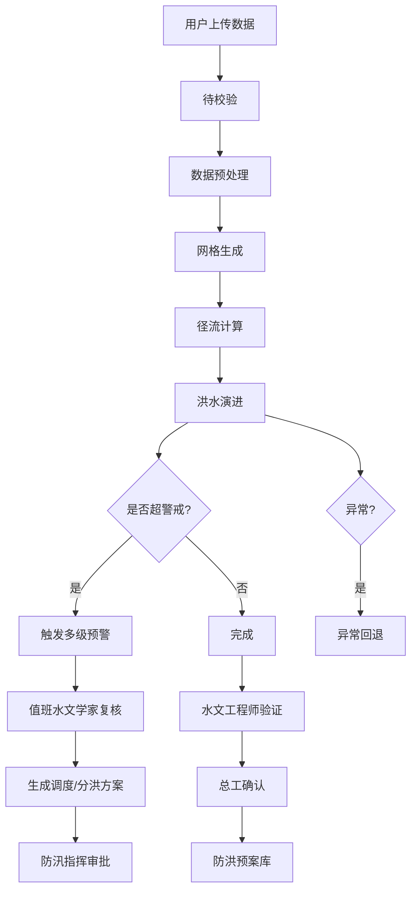
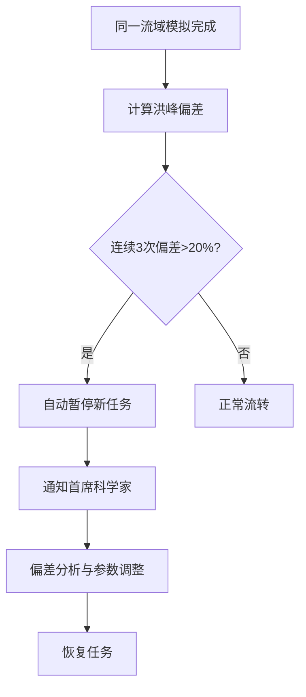

## 1. 产品概述

高精度流域径流模拟与洪水智能预警平台是面向水文防汛部门的专业级决策支持系统，提供DEM/土壤/降雨数据驱动的分布式水文建模、实时径流计算、多级洪水预警、智能调度推荐及两级审批全流程管理。

- 目标用户：值班水文学家、水文工程师、总工、防汛指挥部门、首席科学家
- 核心价值：提升洪水预报精度、缩短预警响应时间、优化水库调度决策、建立标准化审批流程

## 2. 核心功能

### 2.1 用户角色

| 角色 | 注册方式 | 核心权限 |
|------|----------|----------|
| 值班水文学家 | 系统分配 | 数据上传、监控预警、复核预警信号、发起调度建议 |
| 水文工程师 | 系统分配 | 模型验证、精度评估、提交审批 |
| 总工 | 系统分配 | 最终审批、结果确认、预案入库 |
| 防汛指挥部门 | 系统分配 | 查看调度方案、分洪建议、审批调度决策 |
| 首席科学家 | 系统分配 | 偏差异常处理、任务暂停/恢复、调度规则优化 |
| 系统管理员 | 系统分配 | 用户管理、权限配置、系统监控 |

### 2.2 功能模块

1. **全天候看板**：性能雷达图、模拟完成率、预警提前量、预报准确度、任务状态统计
2. **模拟任务中心**：任务列表、状态流转、任务详情、偏差监控
3. **数据上传与建模**：DEM上传、土壤类型上传、降雨序列上传、参数初始化、模型构建
4. **实时监控预警**：河道断面水位/流量监控、警戒阈值、多级预警推送、异常上涨速率检测
5. **调度与审批**：预警复核、调度方案生成、分洪建议、两级审批流程
6. **结果分析可视化**：流量过程线、淹没范围动态图、洪峰概率分布、数据导出
7. **智能推荐引擎**：历史模拟分析、最优调度规则推荐、偏差异常告警

### 2.3 页面详情

| 页面名称 | 模块名称 | 功能描述 |
|----------|----------|----------|
| 全天候看板 | 性能概览 | 性能雷达图（6维度）、今日完成率、预警提前量、预报准确度 |
| 全天候看板 | 任务状态 | 各阶段任务数量统计饼图、待处理预警、最近审批 |
| 全天候看板 | 实时动态 | 实时预警信息流、最新模拟结果、偏差异常提示 |
| 模拟任务中心 | 任务列表 | 筛选/搜索任务、任务状态徽章、进度条、流域信息 |
| 模拟任务中心 | 状态流转 | "待校验→数据预处理→网格生成→径流计算→洪水演进→完成/异常回退"可视化流程 |
| 模拟任务中心 | 任务详情 | 参数配置、计算日志、断面监控、预警记录、审批历史 |
| 数据上传与建模 | 文件上传 | DEM/土壤类型/降雨序列拖拽上传、文件格式校验、数据预览 |
| 数据上传与建模 | 模型构建 | 参数自动初始化、网格生成进度、模型配置、校验结果 |
| 实时监控预警 | 断面监控 | 多断面实时水位/流量曲线图、警戒水位线、颜色分级 |
| 实时监控预警 | 预警管理 | 预警列表、级别（蓝/黄/橙/红）、推送状态、复核操作 |
| 调度与审批 | 调度方案 | 水库调度方案自动生成、分洪建议、方案对比 |
| 调度与审批 | 审批流程 | 水文工程师验证→总工确认→防洪预案库，审批意见留痕 |
| 结果分析可视化 | 图表展示 | 流量过程线、淹没范围热力图、洪峰概率分布直方图 |
| 结果分析可视化 | 数据导出 | 按重现期/流域面积/时间窗口筛选、导出径流深和洪峰流量 |
| 智能推荐引擎 | 规则推荐 | 历史模拟统计、最优调度规则推荐、置信度评分 |
| 智能推荐引擎 | 偏差监控 | 连续三次超20%偏差自动告警、任务暂停、首席科学家通知 |

## 3. 核心流程

### 3.1 模拟任务全生命周期

用户上传DEM、土壤类型和逐小时降雨文件后，系统自动构建分布式水文模型，任务按"待校验→数据预处理→网格生成→径流计算→洪水演进→完成"自动流转，异常时触发回退。计算过程中实时监控河道断面，超警戒或速率异常时触发多级预警，经值班水文学家复核后自动生成调度方案，进入两级审批流程。模拟完成后生成可视化图表并支持数据导出，结果经水文工程师验证和总工确认后入库。

### 3.2 流程图

### 3.3 偏差异常处理流程

## 4. 用户界面设计

### 4.1 设计风格

- **主色调**：深邃科技蓝（#0A1628）+ 警戒色系（蓝#2563EB/黄#F59E0B/橙#EA580C/红#DC2626）
- **辅助色**：数据青绿#059669、中性灰#64748B
- **按钮风格**：扁平化微圆角（4px）、悬浮时轻微上浮+发光、危险操作红色描边
- **字体**：标题使用 Noto Sans SC 700，正文使用 Inter 400/500，数据展示使用 JetBrains Mono
- **布局风格**：左侧导航栏+顶部状态栏+主内容区三栏式，卡片化模块布局，深色科技主题
- **图标风格**：Lucide Icons 线性图标，预警状态使用实心圆点

### 4.2 页面设计概览

| 页面名称 | 模块名称 | UI元素 |
|----------|----------|--------|
| 全天候看板 | 性能概览 | 六边形雷达图、KPI数值卡片带趋势箭头、渐变背景 |
| 全天候看板 | 任务状态 | 环形进度图、状态徽章、颜色编码列表 |
| 全天候看板 | 实时动态 | 时间线滚动、预警闪烁动画、状态颜色脉冲 |
| 模拟任务中心 | 任务列表 | 数据表格、状态胶囊、线性进度条、行展开详情 |
| 模拟任务中心 | 状态流转 | 水平步骤条、节点发光动画、连接线渐变 |
| 数据上传与建模 | 文件上传 | 虚线拖拽区、文件缩略图、进度条、格式图标 |
| 实时监控预警 | 断面监控 | 多Y轴面积图、警戒阈值虚线、颜色区域填充 |
| 调度与审批 | 审批流程 | 垂直审批链、头像+状态、审批意见气泡 |
| 结果分析可视化 | 图表展示 | 交互式SVG图表、悬浮tooltip、动画加载 |

### 4.3 响应式设计

- 桌面端优先设计（1440px基准）
- 平板端：导航栏折叠为抽屉，卡片两列布局
- 移动端：单列垂直布局，表格转卡片列表，图表自适应

### 4.4 动效设计

- 页面加载：卡片交错淡入（staggered fade-in）
- 预警触发：红色脉冲光环 + 数字跳动动画
- 状态流转：步骤节点发光扩散
- 数据更新：数值滚动过渡（count-up animation）
- 图表渲染：路径描边动画（stroke-dashoffset）
