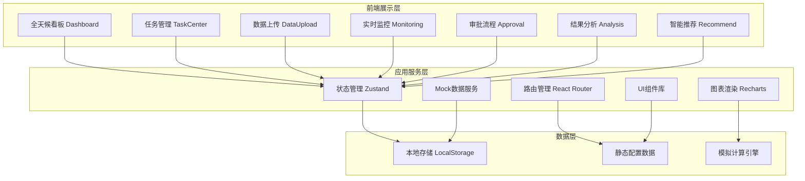
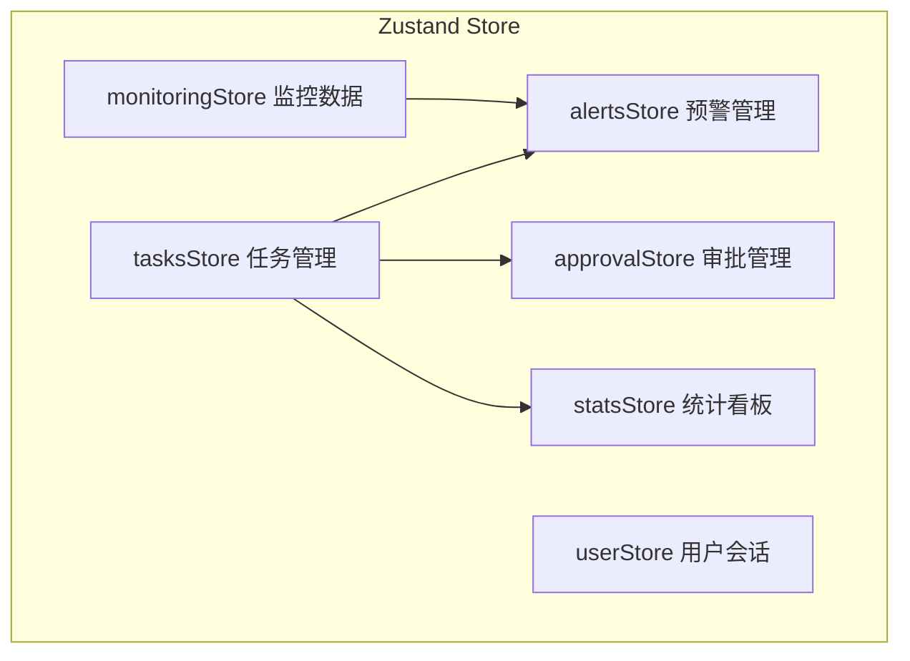

## 1. 架构设计



## 2. 技术选型

- **前端框架**：React@18.2.0 + TypeScript
- **构建工具**：Vite@5.x
- **样式方案**：TailwindCSS@3.4.x + CSS Variables
- **状态管理**：Zustand@4.x
- **路由管理**：React Router@6.x
- **图表库**：Recharts@2.x（折线/面积/柱状/饼图/雷达图）
- **图标库**：Lucide React
- **日期处理**：date-fns
- **UI组件**：基于TailwindCSS自定义组件体系
- **数据模拟**：内置Mock数据生成器

## 3. 路由定义

| 路由路径 | 页面名称 | 说明 |
|----------|----------|------|
| `/dashboard` | 全天候看板 | 默认首页，性能雷达图、KPI指标、实时动态 |
| `/tasks` | 模拟任务中心 | 任务列表、状态流转、任务详情 |
| `/upload` | 数据上传与建模 | DEM/土壤/降雨文件上传、模型构建 |
| `/monitoring` | 实时监控预警 | 断面水位流量监控、预警管理 |
| `/approval` | 调度与审批 | 调度方案、两级审批流程 |
| `/analysis` | 结果分析可视化 | 流量过程线、淹没图、洪峰分布、数据导出 |
| `/recommend` | 智能推荐引擎 | 调度规则推荐、偏差异常监控 |

## 4. 核心数据类型定义

```typescript
// 任务状态枚举
type TaskStatus = 'pending' | 'preprocessing' | 'meshing' | 'calculating' | 'routing' | 'completed' | 'error';

// 预警级别
type AlertLevel = 'blue' | 'yellow' | 'orange' | 'red';

// 审批状态
type ApprovalStatus = 'draft' | 'engineer_pending' | 'engineer_approved' | 'chief_pending' | 'approved' | 'rejected';

// 用户角色
type UserRole = 'hydrologist' | 'engineer' | 'chief' | 'commander' | 'scientist' | 'admin';

// 模拟任务
interface SimulationTask {
  id: string;
  name: string;
  basinName: string;
  basinArea: number;
  createdAt: string;
  status: TaskStatus;
  progress: number;
  rainfallReturnPeriod: number;
  parameters: ModelParameters;
  files: UploadedFile[];
  alerts: Alert[];
  sections: RiverSection[];
  result?: SimulationResult;
  approval?: ApprovalRecord;
  deviationRate?: number;
}

// 模型参数
interface ModelParameters {
  demResolution: number;
  soilType: string;
  cnValue: number;
  initialLoss: number;
  recessionCoefficient: number;
  routingVelocity: number;
  manningN: number;
}

// 河道断面
interface RiverSection {
  id: string;
  name: string;
  riverKm: number;
  warningLevel: number;
  guaranteedLevel: number;
  currentWaterLevel: number;
  currentDischarge: number;
  historicalLevels: TimeSeriesPoint[];
  historicalDischarges: TimeSeriesPoint[];
  risingRate: number;
}

// 预警记录
interface Alert {
  id: string;
  taskId: string;
  sectionId: string;
  level: AlertLevel;
  type: 'water_level' | 'rising_rate';
  value: number;
  threshold: number;
  triggeredAt: string;
  reviewed: boolean;
  reviewedBy?: string;
  reviewedAt?: string;
  reviewComment?: string;
}

// 调度方案
interface DispatchPlan {
  id: string;
  taskId: string;
  alertId: string;
  type: 'reservoir' | 'flood_diversion';
  reservoirName?: string;
  releaseRate: number;
  diversionArea?: string;
  diversionVolume: number;
  estimatedEffect: string;
  createdAt: string;
  status: ApprovalStatus;
}

// 审批记录
interface ApprovalRecord {
  id: string;
  taskId: string;
  engineerId: string;
  engineerName: string;
  engineerComment: string;
  engineerApprovedAt?: string;
  accuracyScore: number;
  chiefId?: string;
  chiefName?: string;
  chiefComment?: string;
  chiefApprovedAt?: string;
  status: ApprovalStatus;
}

// 模拟结果
interface SimulationResult {
  id: string;
  taskId: string;
  peakDischarge: number;
  peakTime: string;
  totalRunoffDepth: number;
  floodVolume: number;
  inundationArea: number;
  hydrograph: TimeSeriesPoint[];
  inundationMap: InundationCell[];
  peakProbability: ProbabilityBin[];
  completedAt: string;
}

// 时间序列点
interface TimeSeriesPoint {
  time: string;
  value: number;
}

// 淹没单元格
interface InundationCell {
  x: number;
  y: number;
  depth: number;
}

// 概率分布区间
interface ProbabilityBin {
  range: string;
  probability: number;
  count: number;
}

// 上传文件
interface UploadedFile {
  id: string;
  name: string;
  type: 'dem' | 'soil' | 'rainfall';
  size: number;
  uploadedAt: string;
  status: 'uploading' | 'validated' | 'error';
}

// 日度统计
interface DailyStats {
  date: string;
  completionRate: number;
  avgLeadTime: number;
  forecastAccuracy: number;
  totalTasks: number;
  completedTasks: number;
  alertsCount: number;
}
```

## 5. 状态管理架构



## 6. 项目目录结构

```
src/
├── assets/              # 静态资源
├── components/          # 通用组件
│   ├── ui/             # 基础UI组件（卡片、按钮、表格等）
│   ├── charts/         # 图表组件
│   └── layout/         # 布局组件
├── pages/              # 页面组件
│   ├── Dashboard/
│   ├── TaskCenter/
│   ├── DataUpload/
│   ├── Monitoring/
│   ├── Approval/
│   ├── Analysis/
│   └── Recommend/
├── store/              # Zustand状态管理
├── types/              # TypeScript类型定义
├── utils/              # 工具函数
│   ├── mock/           # Mock数据生成
│   ├── format.ts       # 格式化函数
│   └── calculation.ts  # 水文计算工具
├── hooks/              # 自定义Hooks
├── styles/             # 全局样式
├── App.tsx
├── main.tsx
└── router.tsx
```

## 7. 模拟计算引擎（前端Mock）

内置简化版水文计算模块，用于生成可视化数据：
- **产流计算**：基于SCS-CN方法生成径流深
- **汇流计算**：基于单位线法生成流量过程线
- **洪水演进**：基于Muskingum方法进行河道演进
- **概率分布**：蒙特卡洛模拟生成洪峰概率分布
